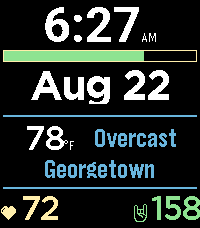

# kface

A watchface for the Pebble Time 2 (emery), written in C against the Pebble
SDK. Shows time, date, battery, weather, heart rate, and steps since
midnight, at a glance, with a small MVC structure underneath.



## Features

- **Time** in 12h or 24h format, following the watch's system setting (no
  leading zero in 12h mode, AM/PM shown when not 24h)
- **Date**
- **Battery meter** — a thin bar between time and date; green fill shows
  charge remaining, with a yellow border
- **Weather** — current temperature (°F) and condition, plus the city it was
  fetched for, refreshed via geolocation + [Open-Meteo](https://open-meteo.com)
  through the phone (PebbleKit JS companion — Pebble watches have no
  built-in weather API)
- **Heart rate** (from the watch's optical sensor)
- **Steps since midnight**

## Building & running

The `pebble` CLI needs its virtualenv active:

```sh
source /data/virtual/python/pebble/bin/activate
```

```sh
pebble build                                 # build for all targetPlatforms
pebble install --emulator emery              # install on the emery emulator
pebble install --phone <ip>                  # install to a paired phone over wifi
pebble logs --phone <ip> -v                  # live app logs
pebble screenshot --phone <ip> out.png       # grab a screenshot from the device
```

This is an emery-only build (`targetPlatforms` in `package.json` is locked
to `["emery"]`, i.e. Pebble Time 2) — the layout is tuned pixel-by-pixel
against that display and isn't guaranteed to look right on other Pebble
hardware.

Note: changing `package.json`'s `messageKeys` requires `pebble clean` before
the next build — an incremental `pebble build` won't regenerate
`build/include/message_keys.auto.h`.

## Project layout

```
src/c/
  kface.c                  App/window lifecycle only — no model/view/event knowledge.
  mvc/
    controller.{c,h}       The only place system event subscriptions happen.
    model.{c,h}            All data access — time, date, battery, heart rate,
                            steps, and weather (pushed in from the phone).
    views/                 One file pair per screen element (time, battery,
                            dividers, weather, heart, steps), each owning its
                            own layer(s).
  pkjs/
    index.js               PebbleKit JS companion (runs on the phone): does
                            geolocation + an Open-Meteo fetch, then sends the
                            result to the watch as an AppMessage.
resources/        Images, fonts, other bundled resources.
package.json      App metadata: UUID, target platform, resources, message keys.
wscript           waf build rules.
build/            Generated output — not tracked in git.
```

See `CLAUDE.md` for a more detailed breakdown of the MVC structure and
conventions used throughout, plus hardware-specific gotchas discovered
along the way.

## Documentation

Full SDK docs, tutorials, and API reference: <https://developer.repebble.com>
